# Matrix Relay Daemon - State Machines and Flowcharts

# 1. High-Level System Architecture Flow

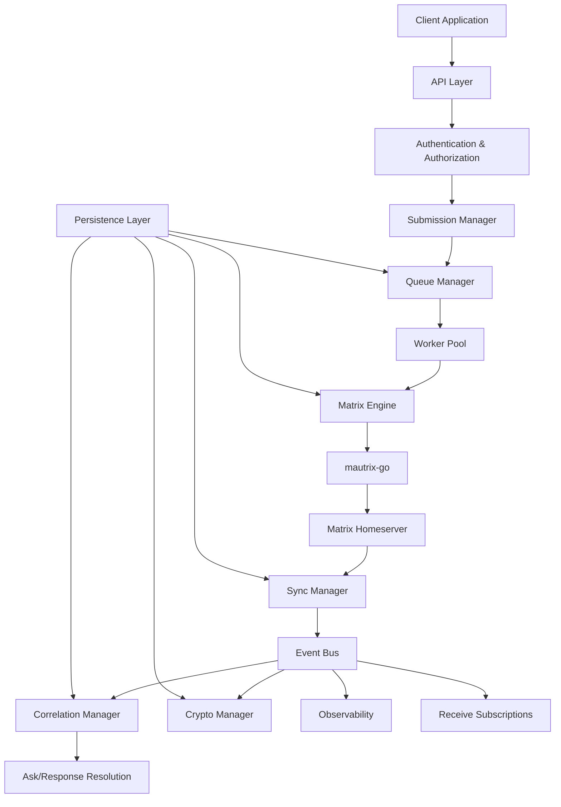

---

# 2. Outbound Message Lifecycle State Machine

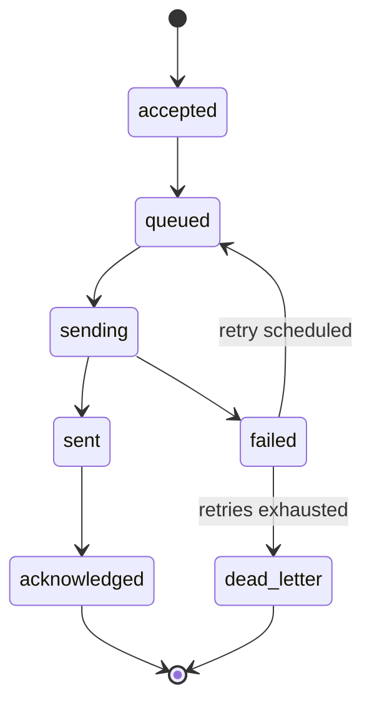

---

# 3. Queue Retry Flowchart

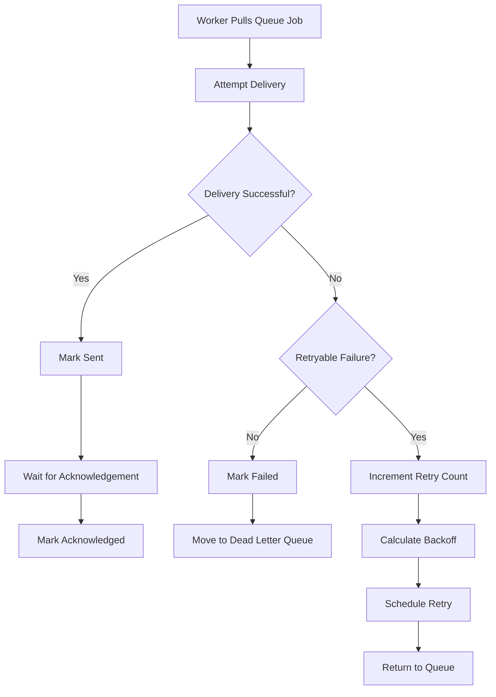

---

# 4. Sync Manager Event Flow

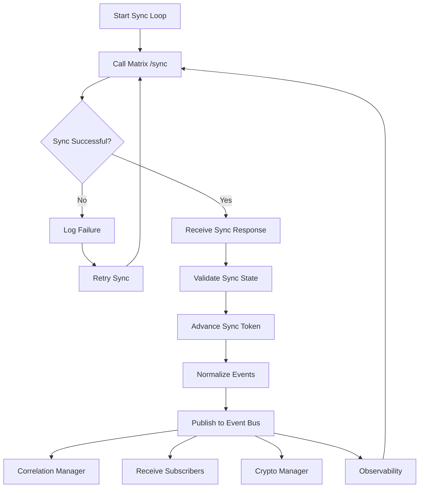

---

# 5. Ask/Response Lifecycle State Machine

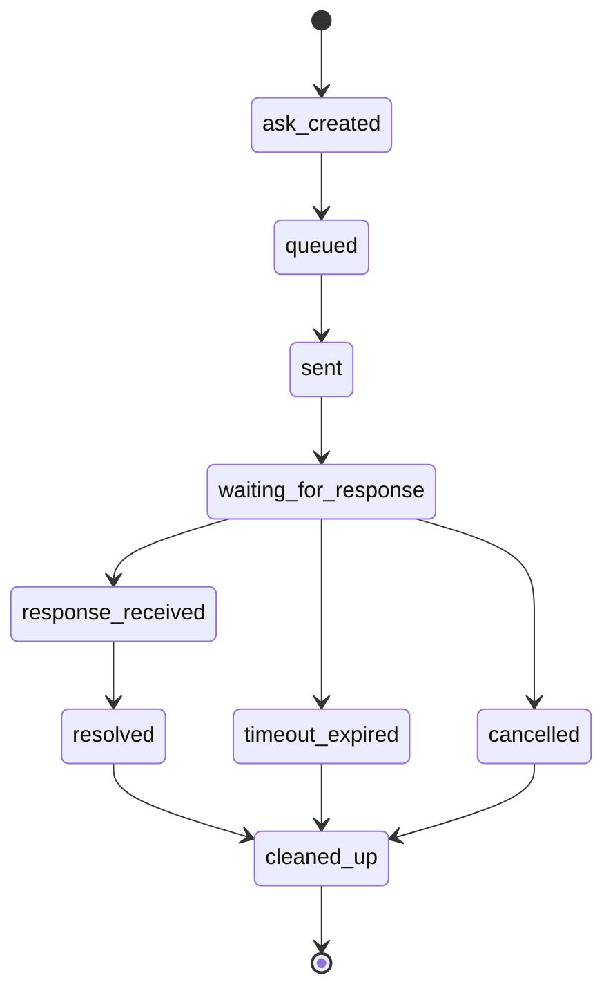

---

# 6. Ask/Response Correlation Flowchart

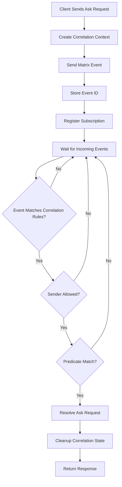

---

# 7. Receive Subscription Lifecycle

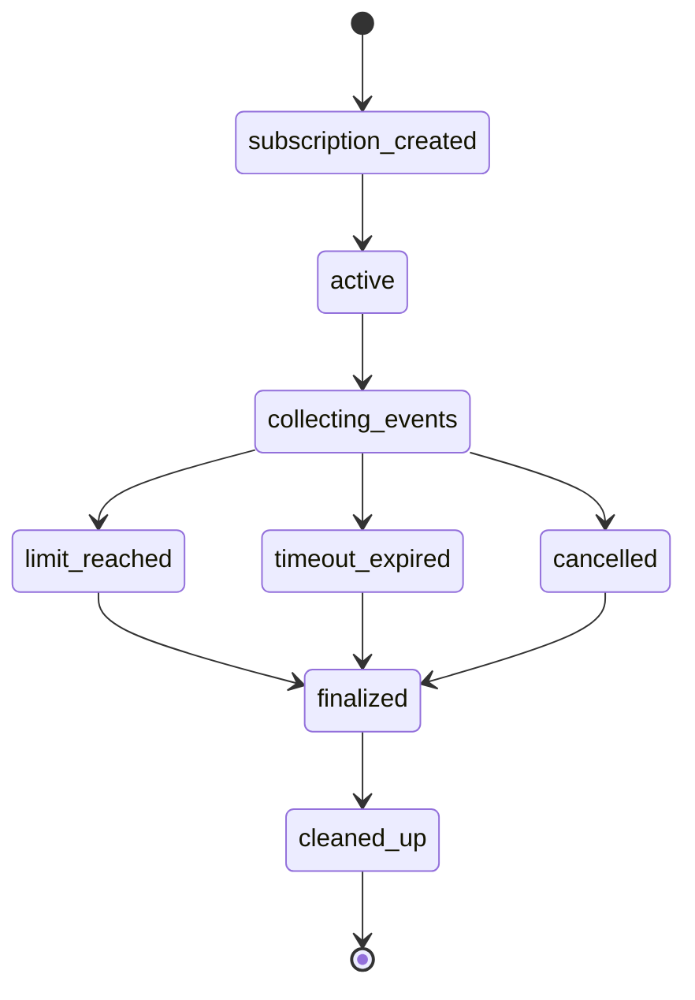

---

# 8. Multi-Account Startup Flow

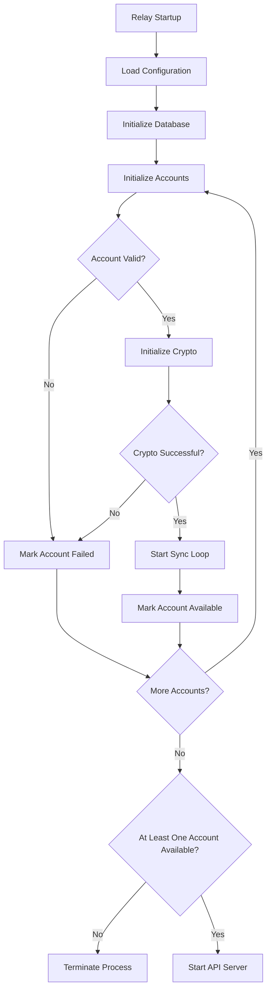

---

# 9. Multi-Account Isolation Diagram

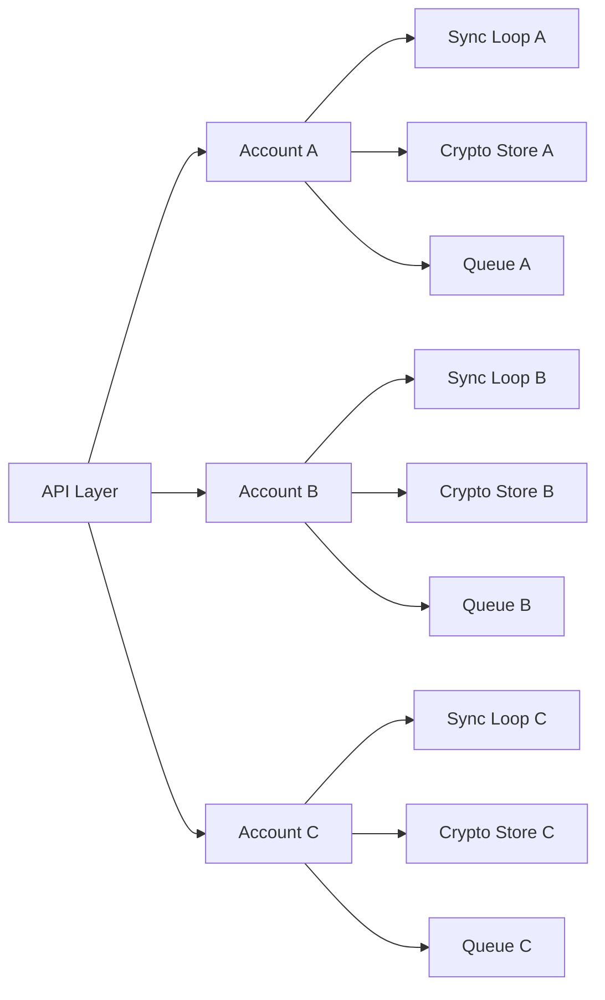

---

# 10. Encryption Lifecycle Flowchart

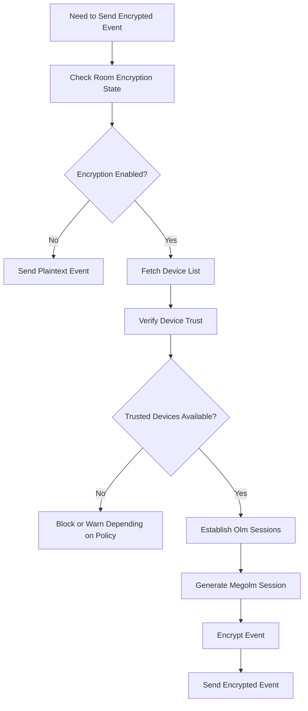

---

# 11. Device Verification State Machine

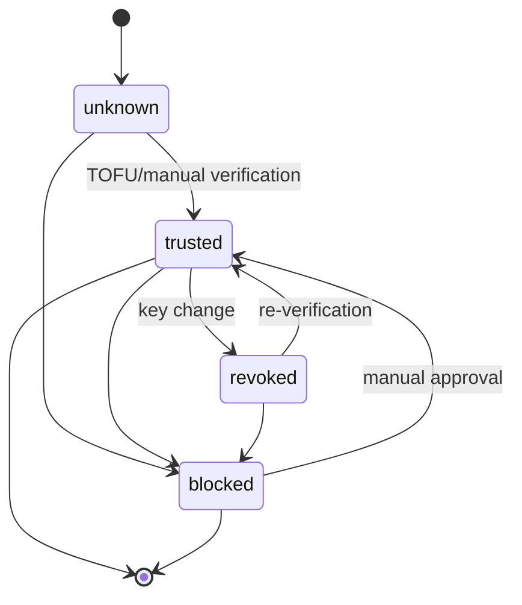

---

# 12. Event Bus Internal Flow

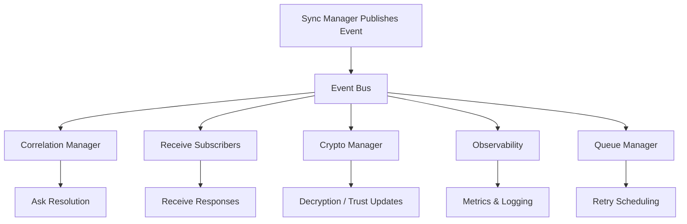

---

# 13. API Request Flow

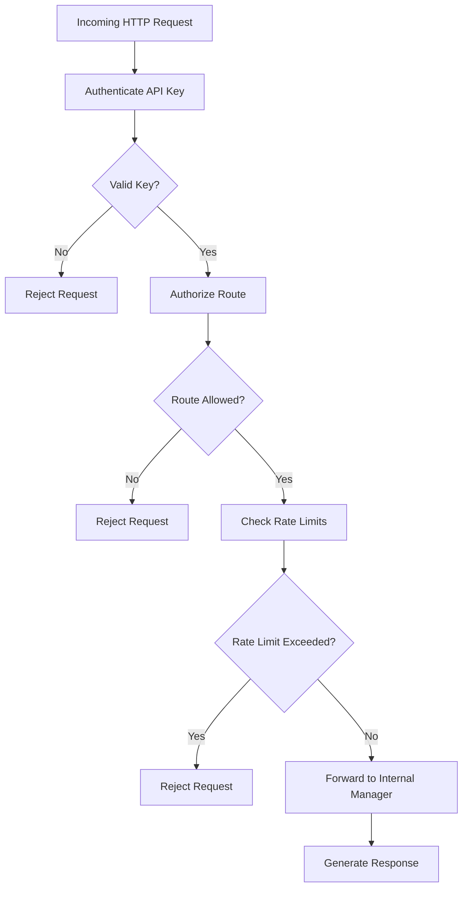

---

# 14. Relay Failure Handling Flow

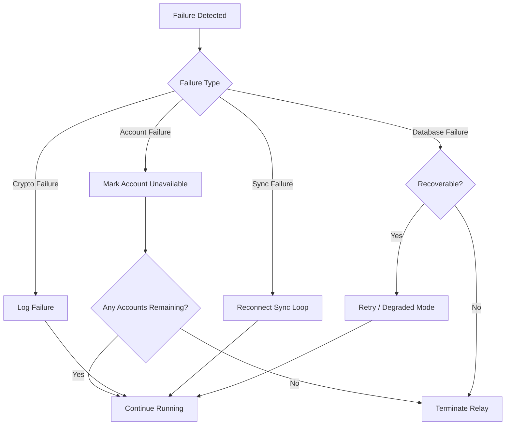

---

# 15. Complete Outbound Send Sequence Diagram

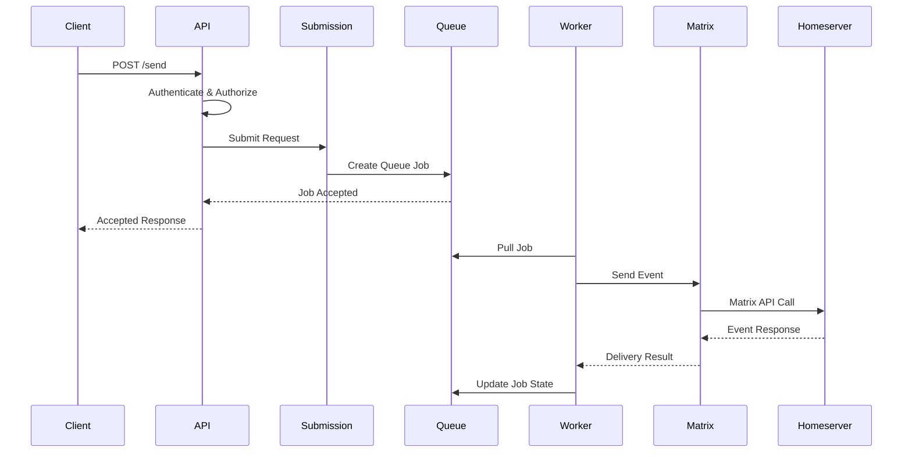

---

# 16. Complete Ask/Response Sequence Diagram

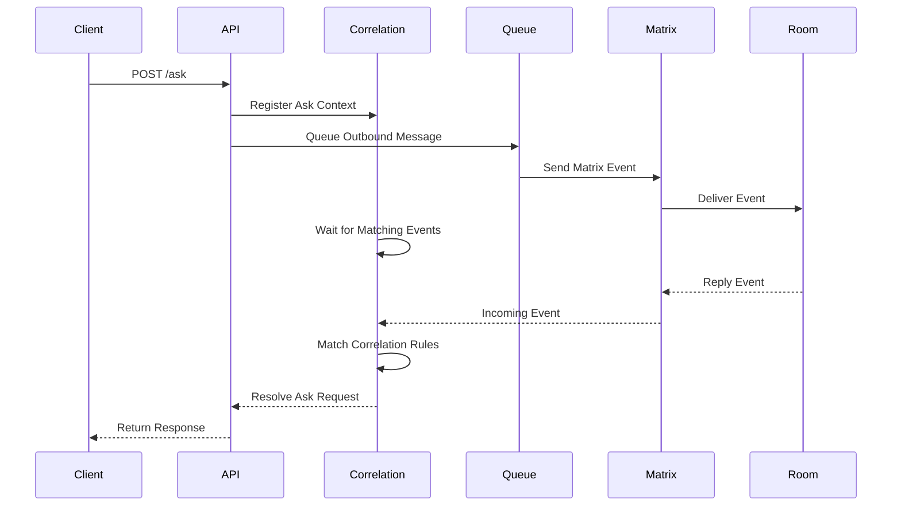
